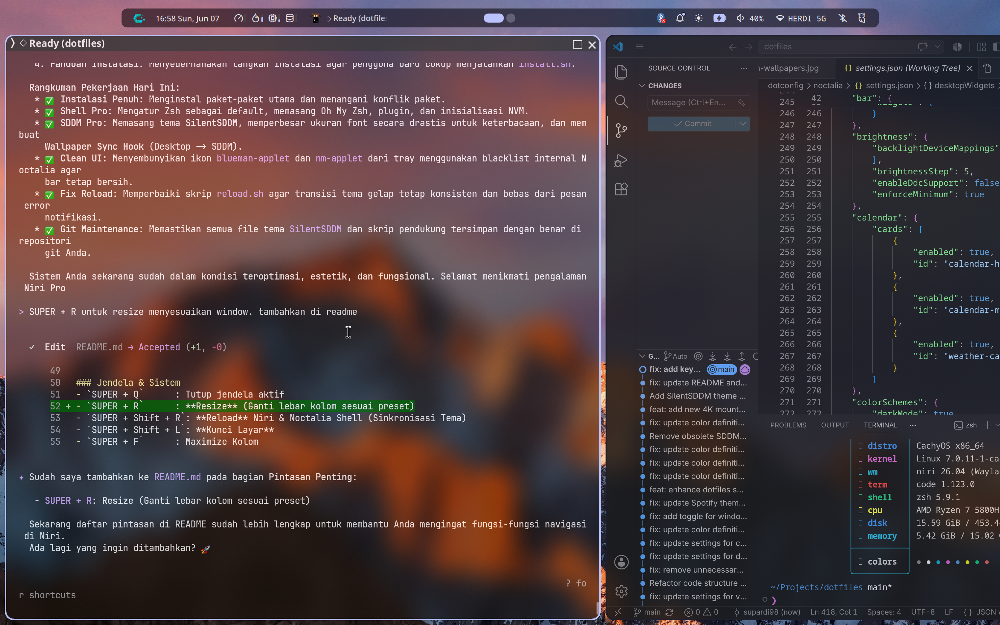
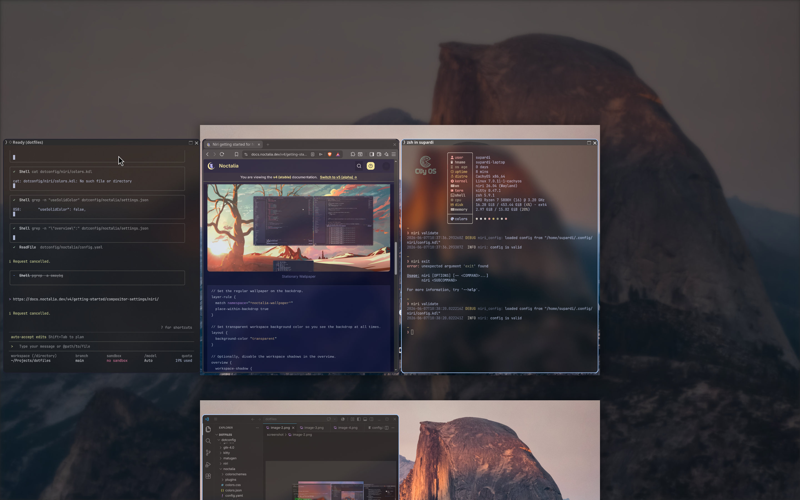
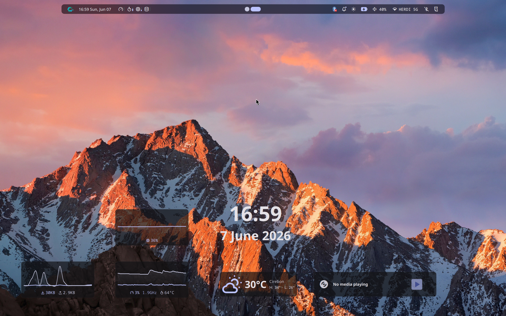
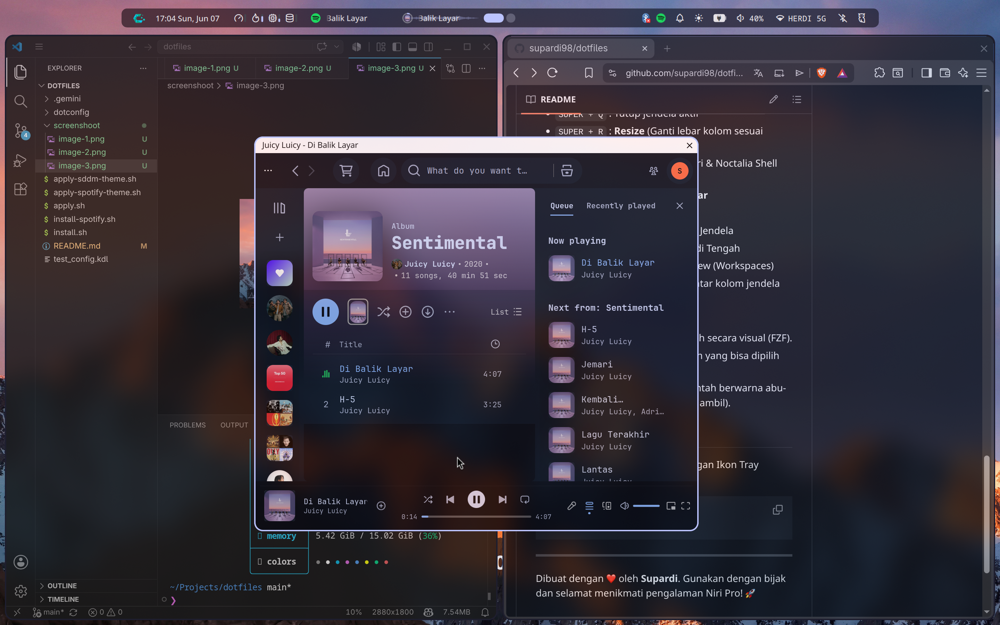

# 🚀 My Ultimate Dotfiles (Niri + Noctalia Shell Pro)



Repositori ini adalah koleksi konfigurasi pribadi (ricing) untuk lingkungan desktop **Niri** yang estetik, modern, dan sangat fungsional, dipadukan dengan **Noctalia Shell** (Qt6/QML) dan alur kerja terminal **Zsh Pro**.

## ✨ Fitur Utama
- **Niri WM**:
  - **Scrollable Tiling**: Pengalaman tiling yang unik secara horizontal.
  - **Glassy Look**: Efek blur transparan dan animasi halus di seluruh jendela (Kitty, Nautilus, Brave, dll).
  - **Dynamic Borders**: Warna border jendela otomatis mengikuti tema Noctalia (via custom sync script).
  - **Native Screenshot**: UI interaktif bawaan Niri untuk pengambilan gambar layar yang mulus.
- **Noctalia Shell**:
  - **Modern UI**: Panel, launcher, dan widget berbasis Qt6/QML yang sangat responsif.
  - **Integrated Selector**: Pemilih wallpaper dan skema warna langsung dari panel.
  - **Smart Desktop**: Notifikasi glassy, clipboard history terintegrasi, dan emoji picker.
- **Zsh Pro Experience**: 
  - **Oh My Zsh**: Framework Zsh dengan plugin produktivitas.
  - **Oh My Posh**: Prompt terminal informatif dengan Tema Zen.
  - **Smart Navigation**: `zoxide` (Smart CD) dan `fzf` (Fuzzy Search).
- **System & Automation**:
  - **Emoji IOS**: Tampilan emoji bergaya IOS yang konsisten di seluruh sistem (terintegrasi dengan **Auto Insert** via `wtype`).
  - **One-Click Sync**: Shortcut reload tunggal untuk sinkronisasi warna, refresh Niri, dan restart shell.

## 🛠️ Cara Instalasi (Otomatis) - REKOMENDASI

Skrip ini akan menginstal semua paket yang dibutuhkan (Pacman & AUR), mengonfigurasi Zsh, dan melakukan symlink konfigurasi secara otomatis.

1. **Clone Repositori:**
   ```bash
   git clone https://github.com/supardi98/dotfiles.git ~/Projects/dotfiles
   cd ~/Projects/dotfiles
   ```

2. **Jalankan Skrip Instalasi:**
   ```bash
   chmod +x install.sh
   ./install.sh
   ```

## ⌨️ Pintasan Penting (Keybindings)

### Dasar & Aplikasi
- `SUPER + RETURN` : Buka **Kitty** Terminal
- `SUPER + SPACE`  : Buka **Launcher** Noctalia
- `SUPER + E`      : Buka File Manager (Nautilus)
- `SUPER + B`      : Buka Browser (**Brave**)
- `SUPER + V`      : Riwayat **Clipboard** (Auto-Paste)
- `SUPER + .`      : **Emoji Picker** (Auto-Insert)

### Jendela & Sistem
- `SUPER + Q`      : Tutup jendela aktif
- `SUPER + SHIFT + Q`: **Force Kill** Jendela (xkill)
- `SUPER + T`      : **Toggle Floating** (Ubah jendela melayang/tiling)
- `SUPER + R`      : **Switch Width** (Ganti lebar kolom: 1/3, 1/2, 2/3, Full)
- `SUPER + S`      : **Consume Window** (Menumpuk jendela ke dalam kolom)
- `SUPER + SHIFT + S`: **Expel Window** (Mengeluarkan jendela dari tumpukan)
- `SUPER + TAB`    : **Next Workspace** (Cycling/Berulang)
- `SUPER + SHIFT + TAB`: **Prev Workspace** (Cycling/Berulang)
- `SUPER + O`      : Tampilan **Overview** Jendela
- `SUPER + \``      : **Scratchpad Terminal** (Gaya Quake)
- `SUPER + SHIFT + R`: **Reload Total** (Niri + Noctalia + Sinkronisasi Warna)
- `SUPER + SHIFT + L`: **Kunci Layar** (Noctalia Native)
- `SUPER + SHIFT + M`: **Pindah Monitor** (Pindahkan jendela ke monitor sebelah)
- `SUPER + M`      : **Toggle Mute Mic**
- `SUPER + Wheel Mouse`: Navigasi cepat antar kolom jendela
- `SUPER + 1-9`    : Pindah ke Workspace 1-9

### Navigasi (VIM Style)
- `SUPER + H / J / K / L` : Pindah Fokus (Kiri, Bawah, Atas, Kanan)
- `SUPER + SHIFT + H / J / K / L` : Pindahkan Jendela

### Screenshot
- `Print`          : Screenshot Interaktif (Pilih area/jendela)
- `Shift + Print`  : Screenshot Seluruh Layar
- `Alt + Print`    : Screenshot Jendela Aktif
- *Hasil tersimpan di: `~/Pictures/Screenshots/`*

## 🎵 Spotify Setup
Instalasi Spotify dengan tema transparan dan integrasi Niri:
```bash
chmod +x install-spotify.sh
./install-spotify.sh
```

---
Dibuat dengan ❤️ oleh **Supardi**. Gunakan dengan bijak dan selamat menikmati pengalaman Niri Pro! 🚀

## 📸 Screenshots
<p align="center">
  
  
  <br />
  
  
</p>
